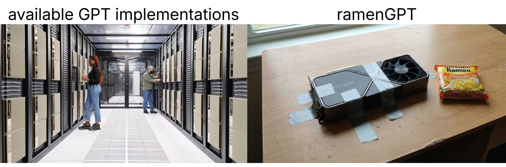

# 🍜 ramenGPT

**Train small GPT models on a single GPU**: Modded [modded-nanogpt](https://github.com/KellerJordan/modded-nanogpt) w/o distributed training.



## Quickstart
On a single GPU machine (eg. 30/40/5090 or A/H100), you can run

```bash
uv venv
uv sync
uv run run.py
```

## Implemented Methods

### Optimizers (`optimizers.py`)

| Method | Paper/Source |
|---|---|
| **Muon** (NorMuon) — momentum orthogonalized by Newton-Schulz with variance reduction | [arxiv.org/abs/2510.05491](https://arxiv.org/abs/2510.05491) |
| **Polar Express** — compiled sign-method orthogonalization used inside Muon | [arxiv.org/abs/2505.16932](https://arxiv.org/abs/2505.16932) |
| **LITE** — Muon with flat-direction dynamics enhancement | [arxiv.org/abs/2602.22681](https://arxiv.org/abs/2602.22681) |
| **BAM** — Balanced Axis Momentum; replaces Newton-Schulz with Sinkhorn normalization | [github.com/knightron0/bam](https://github.com/knightron0/bam) |
| **ARO-Sinkhorn** — adaptively rotated optimization with Sinkhorn normalization | [arxiv.org/abs/2602.09006](https://arxiv.org/abs/2602.09006) |
| **Spectron** — optimizer for low-rank matrix factor pairs using polar express + power iteration | custom |

### Architecture (`model.py`, `mlps.py`)

| Method | Paper/Source |
|---|---|
| **FlexAttention** — PyTorch native block-sparse attention | [PyTorch blog](https://pytorch.org/blog/flexattention/) |
| **YaRN RoPE** — dynamic context-length adaptation for rotary embeddings | [arxiv.org/abs/2309.00071](https://arxiv.org/abs/2309.00071) |
| **Long-short sliding window attention** — alternating window sizes across layers | [Gemma 2](https://arxiv.org/abs/2408.00118) |
| **Logit softcapping** — sigmoid-bounded output logits | [Gemma 2](https://arxiv.org/abs/2408.00118) |
| **HyperConnections / mHC** — dynamic multi-stream residual routing with manifold constraints | [arxiv.org/abs/2409.19606](https://arxiv.org/abs/2409.19606) |
| **Normalized feedforward (nFF)** — L2-norm-based nGPT feedforward | [arxiv.org/abs/2410.01131](https://arxiv.org/abs/2410.01131) |
| **Deep residual MLP** — periodic residuals (Wang et al.) | [arxiv.org/abs/2503.14858](https://arxiv.org/abs/2503.14858) |

Various other tricks (QK norm, value embeddings, merged QKVO, sparse gated attention, smear/skip gates, key offset, BOS-aligned batching, batch/window size scheduling, embedding split) from [modded-nanogpt](https://github.com/KellerJordan/modded-nanogpt).

# References

* [modded-nanogpt](https://github.com/KellerJordan/modded-nanogpt)
* [nanoGPT](https://github.com/karpathy/nanoGPT)
* [mHC-manifold-constrained-hyper-connections](https://github.com/tokenbender/mHC-manifold-constrained-hyper-connections)
